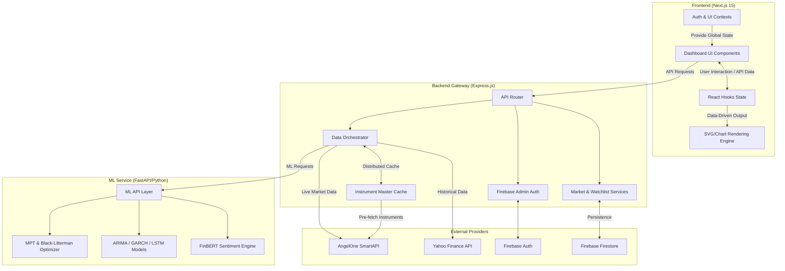

# 🏦 AngelFive — DSFM Analytics Dashboard

[](https://github.com/ojhaprathmesh/AngelFive_DSFM_Repo/actions/workflows/ci.yml)
[](https://github.com/ojhaprathmesh/AngelFive_DSFM_Repo/actions/workflows/security.yml)

[](https://nextjs.org/)
[](https://expressjs.com/)
[](https://fastapi.tiangolo.com/)
[](https://pytorch.org/)

**AngelFive** is a production-ready financial analytics platform that bridges the gap between raw market data and actionable quantitative insights.

Built using **DSFM (Data Science in Financial Markets)**, it combines real-time data, statistical modeling, machine learning, and portfolio optimization into a unified, broker-style dashboard.

---

## 🚀 Why AngelFive?

Retail investors typically lack access to institutional-grade tools used by hedge funds and quant firms. Most platforms provide charts — but not **decision intelligence**.

**AngelFive solves this by integrating:**

* Statistical validation (ADF, stationarity)
* ML-driven sentiment (FinBERT)
* Time-series forecasting (ARIMA, GARCH, LSTM)
* Portfolio optimization (MPT, Black-Litterman)

👉 All inside a single, real-time dashboard.

---

## ✨ Key Highlights

* 🧠 **Full-stack microservices architecture** (Next.js + Express + FastAPI)
* 📊 **Real-time + historical data integration** (AngelOne SmartAPI + Yahoo Finance)
* 🤖 **Production-grade ML models** (FinBERT, LSTM, GARCH)
* ⚖️ **Institutional portfolio optimization** (Efficient Frontier + Black-Litterman)
* 🔐 **Secure backend architecture** (no API key exposure to client)
* ⚡ **Optimized performance** with caching and model warmup

---

## 🛠️ Core Features

### 📈 Returns Analysis (DSFM Foundations)

* Augmented Dickey-Fuller (ADF) test for stationarity
* ACF / PACF for lag & seasonality detection
* Volatility modeling using GARCH

### 🎭 Sentiment Analytics

* FinBERT for financial sentiment classification
* Hybrid approach combining rule-based + deep learning signals

### ⚖️ Portfolio Optimization

* Efficient Frontier visualization (Markowitz)
* Black-Litterman model for stable, view-adjusted allocation
* Portfolio constraints for diversification control

---

## 🏗️ Technical Architecture

AngelFive follows a **3-tier microservices architecture** designed for scalability, modularity, and separation of concerns.

### High-Level System Flow



### Architecture Breakdown

1. **Frontend (Next.js 16 + React 19)**
   * Handles UI, state management, and data visualization
   * Uses SVG/chart rendering for financial graphs
   * Maintains global state via React contexts

2. **Backend (Express.js + Redis)**
   * Acts as API gateway and orchestration layer
   * Handles authentication via Firebase Admin SDK
   * Manages distributed caching (`ioredis`) and external API coordination

3. **ML Service (FastAPI + Python)**
   * Dedicated compute layer for heavy analytics
   * Runs statistical models and ML inference via Pydantic-validated endpoints
   * Prevents blocking Node.js event loop

---

## 🚦 Quickstart

### 1. Prerequisites
* Docker & Docker Desktop (Windows/Mac)
* Node.js (v20+) & pnpm (v11)

---

### 2. Environment Setup
Create `.env` files based on the `.env.example` files in each workspace:
```bash
cp backend/.env.example backend/.env
cp frontend/.env.example frontend/.env
cp ml-service/.env.example ml-service/.env
```

---

### 3. Run with Docker Compose (Recommended)
The entire monorepo is containerized for seamless development and production parity.

```bash
docker compose -f docker-compose.dev.yml up --build
```
- Frontend: `http://localhost:3000`
- Backend: `http://localhost:5000`
- ML Service: `http://localhost:8000`
- Redis: `localhost:6379`

### 4. Run Locally (Manual)
If you prefer running outside of Docker:
```bash
pnpm install
pnpm dev:backend
pnpm dev:frontend

# In a separate terminal
cd ml-service
uv venv && source .venv/bin/activate
uv pip install -r requirements.txt
fastapi dev src/app.py
```

---

## 🔌 API Overview

### Backend (Express)

* `POST /api/market/smartapi/quote` → Live market data
* `GET /api/watchlist` → Fetch user watchlist
* `POST /api/watchlist` → Update watchlist

### ML Service (FastAPI)

* `POST /dsfm/sentiment/finbert` → Sentiment analysis
* `POST /dsfm/forecast` → Time-series forecasting
* `POST /dsfm/mpt` → Portfolio optimization
* `GET /dsfm/health` → Service health check

---

## 🧠 Design Decisions & Trade-offs

* **FastAPI over Flask**
  Migrated for native async support, automated OpenAPI docs, and strict Pydantic validation.
* **Microservice Separation**
  ML workloads isolated to prevent blocking the single-threaded Node.js event loop.
* **Docker Containerization**
  Guarantees environment parity and solves complex Python/Node dependency cross-contamination.
* **Safetensors vs Pickle**
  Prevents arbitrary code execution vulnerabilities when loading PyTorch model weights.
* **Redis Distributed Caching**
  Replaced process-local memory caching to enable future horizontal scaling of the Express gateway.

---

## ⚠️ Limitations

* No full historical backtesting engine yet
* Yahoo Finance data may have slight latency (~15 min)
* ML models are pre-trained (not continuously updated)
* High memory usage when running multiple models simultaneously

---

## 🧪 Testing

* Backend: API testing (planned / extendable)
* Frontend: Component-level testing (React Testing Library)
* ML: Unit validation for statistical models

---

## 🤝 Contributing

Contributions are welcome!

1. Fork the repository
2. Create a feature branch
3. Commit changes
4. Open a pull request

---

## 📝 License

Distributed under the MIT License.

---

**Built for the future of quantitative finance.**
