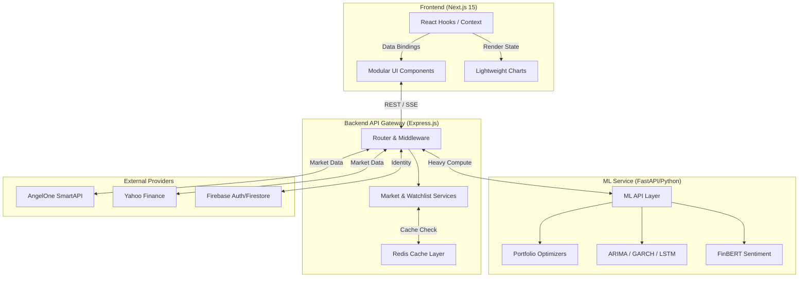

# 🏦 AngelFive — DSFM Analytics Platform

[](https://github.com/ojhaprathmesh/AngelFive_Repo/actions/workflows/ci.yml)
[](https://github.com/ojhaprathmesh/AngelFive_Repo/actions/workflows/docker-build.yml)
[](https://github.com/ojhaprathmesh/AngelFive_Repo/actions/workflows/security-scan.yml)

[](https://nextjs.org/)
[](https://expressjs.com/)
[](https://fastapi.tiangolo.com/)
[](https://pytorch.org/)
[](https://redis.io/)

**AngelFive** is a production-ready financial analytics platform that bridges the gap between raw market data and actionable quantitative insights.

Built using **DSFM (Data Science in Financial Markets)**, it combines real-time data streaming, statistical modeling, machine learning, and portfolio optimization into a unified, broker-style dashboard.

---

## 🚀 Why AngelFive?

Retail investors typically lack access to institutional-grade tools used by hedge funds and quant firms. Most platforms provide basic charts — but not **decision intelligence**.

**AngelFive solves this by integrating:**

* Statistical validation (ADF Stationarity, ACF/PACF)
* ML-driven sentiment (FinBERT NLP)
* Time-series forecasting (ARIMA, GARCH, LSTM)
* Portfolio optimization (Markowitz Efficient Frontier, Black-Litterman)

👉 All inside a highly modular, real-time dashboard engineered for scale.

---

## ✨ Engineering Highlights

* 🧠 **Full-stack Microservices Architecture:** Decoupled Next.js Frontend, Node.js API Gateway, and Python ML computation engine.
* 📊 **Live Market Data:** Integrates AngelOne SmartAPI and Yahoo Finance with intelligent Redis caching to prevent API rate limits.
* 🏗️ **Feature-Oriented React Design:** Highly decomposed UI architecture using custom hooks, orchestrators, and strict TypeScript types.
* 🔐 **Secure & Observable Backend:** Global Pino logging with automatic credentials redaction, Firebase Auth, and explicit CORS/helmet policies.
* 🤖 **Autonomous CI/CD Pipeline:** Fully automated GitHub Actions workflow including Docker Buildx publishing to GHCR, Trivy security scanning, and autonomous AI-driven PR regression analysis.
* 🐳 **Containerized Infrastructure:** 100% Dockerized environments using `docker-compose` for absolute dev/prod parity.

---

## 🛠️ Core Capabilities

### 📈 Returns Analysis (DSFM Foundations)
* Augmented Dickey-Fuller (ADF) tests for stationarity modeling.
* ACF / PACF modeling for lag and seasonality detection.
* Volatility modeling utilizing GARCH architectures.

### 🎭 Sentiment Analytics
* High-performance FinBERT pipeline for financial text classification.
* Hybrid modeling combining rule-based financial dictionaries with deep learning signals.

### ⚖️ Portfolio Optimization
* Automated Efficient Frontier calculations (Markowitz).
* Black-Litterman model integrations for stable, view-adjusted market allocations.

### 📋 Interactive Watchlists
* Real-time symbol tracking across NSE data with drag-and-drop personalization.
* Live-updating lightweight charts rendered purely via decoupled React Hooks.

---

## 🏗️ Technical Architecture

AngelFive follows a strict **3-tier microservices architecture**.

### High-Level System Flow



### 1. Frontend (Next.js 15 + React 19)
- Operates on a highly componentized, feature-folder pattern (e.g., `components/dsfm/returns-analysis/`).
- Employs purely presentational UI elements wrapped by orchestrator components mapping custom state hooks.
- Implements Server-Sent Events (SSE) for zero-latency market and notification streaming.

### 2. Backend (Express.js + Redis)
- Acts as the central integration layer and rate-limiter.
- Handles Auth verification via Firebase Admin SDK.
- Relies heavily on **Redis** to cache expensive ML forecasts and third-party SmartAPI payloads.

### 3. ML Service (FastAPI + Python)
- Completely unblocks the Node.js event loop by taking over heavy PyTorch/Statsmodels workloads.
- Uses `gunicorn` with `uvicorn` workers for production multithreading.
- Leverages `safetensors` over pickles to prevent arbitrary code execution vulnerabilities.

---

## 🚦 Quickstart

### 1. Prerequisites
* Docker & Docker Desktop (Windows/Mac/Linux)
* Node.js (v20+) & pnpm (v11)

### 2. Environment Setup
Copy the environment templates across the monorepo:
```bash
cp backend/.env.example backend/.env
cp frontend/.env.example frontend/.env
cp ml-service/.env.example ml-service/.env
```
*(Ensure you fill out the Firebase and SmartAPI variables inside `backend/.env` for full functionality)*

### 3. Run with Docker Compose (Recommended)
The entire monorepo is containerized for seamless, zero-config startup:

```bash
docker compose -f docker-compose.dev.yml up --build
```

- **Frontend:** `http://localhost:3000`
- **Backend API:** `http://localhost:5000`
- **ML Engine:** `http://localhost:8000`
- **Redis Node:** `localhost:6379`

---

## ⚙️ CI/CD & DevOps Pipeline

AngelFive employs a sophisticated GitHub Actions workflow:
1. **Build & Lint (`ci.yml`):** Type-checks the frontend/backend, verifies Python syntax, tests Redis integration, and validates Docker builds.
2. **Container Registry (`docker-build.yml`):** Automatically packages and pushes images to **GHCR** on `main` updates using Docker Buildx.
3. **Security (`security-scan.yml`):** Autonomous Trivy scanning of all container vulnerabilities, npm/pip dependencies, and misconfigurations.
4. **Deploy & Smoke Tests (`deploy.yml` & `smoke-test.yml`):** Foundational deployment automations triggering render/vercel hooks and verifying post-deploy health endpoints.
5. **AI Regression Analysis (`ai-review.yml`):** Pull Requests are scanned by an autonomous AI agent to flag critical regressions, race conditions, or architecture breaks prior to human review.

---

## 📝 License
Distributed under the MIT License.

---
**Built for the future of quantitative finance.**
